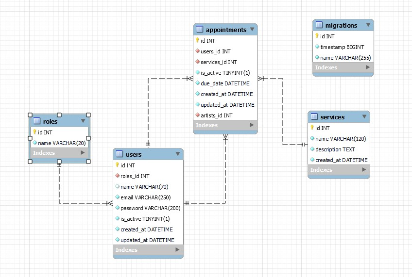

<details>
  <summary>Contenido 📝</summary>
  <ol>
    <li><a href="#objetivo">Objetivo</a></li>
    <li><a href="#sobre-el-proyecto">Sobre el proyecto</a></li>
    <li><a href="#stack">Stack</a></li>
    <li><a href="#deploy-🚀">Deploy</a></li>
    <li><a href="#diagrama-bd">Diagrama</a></li>
    <li><a href="#instalación-en-local">Instalación</a></li>
    <li><a href="#endpoints">Endpoints</a></li>
    <li><a href="#futuras-funcionalidades">Futuras funcionalidades</a></li>
    <li><a href="#contribuciones">Contribuciones</a></li>
    <li><a href="#contacto">Contacto</a></li>
  </ol>
</details>

## Tattoo Studio :metal:
En este proyecto se requería el desarrollo de una API con una base de datos de clientes, servicios y artistas, el objetivo de esta API es permitir la creación, consulta y modificación de citas entre clientes y servicios, con la posibilidad de asignar a un artista para llevar a cabo el servicio.

## Sobre el proyecto :page_facing_up:
Se solicita crear una aplicación web que permita organizar todo lo relacionado a las citas de los clientes para el acceso a los múltiples servicios que ofrece el Studio, en este contexto, los usuarios pueden darse de alta en la aplicación, tener control de sus datos, así mismo puede solicitar citas con fechas posteriores al momento presente, en estas pueden elegir el tipo de servicio que requieren así también como elegir el artista de su predilección. Por parte del administrador principal (súper admin) tiene acceso a la información general de los usuarios, cuidando de los datos sensibles como es la contraseña, la cual está encriptada de principio a fin, asimismo los administradores tienen la capacidad de darse de alta en la plataforma con un rol que les permite crear, editar y eliminar servicios que posteriormente los clientes podrán reservar.


## Stack :anchor:
Tecnologías utilizadas:
<div align="left">
<a href="https://www.mysql.com/">
    
</a>
<a href="https://www.expressjs.com/">
    
</a>
<a href="https://nodejs.org/es/">
    
</a>
<a href="https://developer.mozilla.org/es/docs/Web/JavaScript">
    
</a>
<a href="https://www.github.com/">
    
</a>
<a href="https://git-scm.com/">
    
</a>
<a href="https://jwt.io/">
    
</a>
 </div>

 ## Deploy 🚀 
<div align="left">
    <a href="https://www.google.com"><strong>Url a producción </strong></a>
</div>

## Diagrama BD :zap:


## Instalación en local :computer:
1. Clonar el repositorio
2. ` $ npm install `
3. Conectamos nuestro repositorio con la base de datos 
4. ``` $ npm run migrate ``` 
5. ``` $ npm run db:seed ``` 
6. ``` $ npm run dev ```

## Endpoints :electric_plug:	
<details>
<summary>Endpoints</summary>

- AUTH
    - REGISTER USERS

            POST http://localhost:3380/api/auth/register
        body:
        ``` js
                {
                "name": "pedro",
                "email": "pedro@pedro.com",
                "password": "12345678"
                }
        ```
    - REGISTER ADMIN / ARTISTS

             POST http://localhost:3380/api/auth/admin
         body:
         ``` js
                {
                    "name": "tatuador"
                    "email": "tatuador@tatuador.com",
                    "password": "12345678"
                }
        ```
    - LOGIN

            POST http://localhost:3380/api/auth/login  
        body:
        ``` js
            {
                "email": "pedro@pedro.com",
                "password": "12345678"
            }
        ```
- ROLES
    - GET ALL ROLES (SUPER ADMIN)

            GET http://localhost:3380/api/roles
        Bearer Token:
        ```js
            ExampleTokenJsonWebToken
        ```
    - CREATE ROLES (SUPER ADMIN)

            POST http://localhost:3380/api/roles
        Bearer Token:
        ```js
            ExampleTokenJsonWebToken
        ```
        body:
        ```js
            {
                "name": "tatuador"
            }
        ```
    - DELETE ROLES (SUPER ADMIN)

            DELETE http://localhost:3380/api/roles/:id_role
        Bearer Token:
        ```js
            ExampleTokenJsonWebToken
         ```
- USERS
    - GET ALL USERS (SUPER ADMIN)

            GET http://localhost:3380/api/users
        Bearer Token:
        ```js
            ExampleTokenJsonWebToken
         ```
    - GET USER PROFILE

            GET http://localhost:3380/api/users/profile
        Bearer Token:
        ```js
            ExampleTokenJsonWebToken
         ```
    - UPDATE USER PROFILE

            PUT http://localhost:3380/api/users/profile
        Bearer Token:
        ```js
            ExampleTokenJsonWebToken
         ```
        body:
        ```js
        {
            "name": "tatuador",
            "email": "tatuador@tatuador.com",
            "password": "12345678"
        }
        ```

    - UPDATE USER ROLE (SUPER ADMIN)

            PUT http://localhost:3380/api/users/1/role
        Bearer Token:
        ```js
            ExampleTokenJsonWebToken
        ```
        body:
        ```js
            {
                "roles_id": 3
            }
        ```
    - DELETE USER (SUPER ADMIN)

            PUT http://localhost:3380/api/users/:user_id
        Bearer Token:
        ```js
            ExampleTokenJsonWebToken
        ```
    - GET USER BY EMAIL (SUPER ADMIN)

            PUT http://localhost:3380/api/users/filters?email=example@example.com
        Bearer Token:
        ```js
            ExampleTokenJsonWebToken
        ```
        Params:
        ```js
            email=example@example.com
        ```
    - GET ALL ARTISTS

            GET http://localhost:3380/api/users/artists

- SERVICES
    - GET ALL SERVICES

            GET http://localhost:3380/api/services

    - CREATE NEW SERVICES (ADMIN - SUPER ADMIN)

            POST http://localhost:3380/api/services
        Bearer Token:
        ```js
            ExampleTokenJsonWebToken
        ```
        body:
        ```js
            {
                "name": "service name",
                "description": "service descriptión."
            }
        ```
    - UPDATE SERVICES (ADMIN - SUPER ADMIN)

            PUT http://localhost:3380/api/services/:service_id
        Bearer Token:
        ```js
            ExampleTokenJsonWebToken
        ```
        body:
        ```js
            {
                "name": "service name",
                "description": "service descriptión."
            }
        ```
    - DELETE SERVICES (ADMIN - SUPER ADMIN)

            DELETE http://localhost:3380/api/services/services_id

- APPOINTMENTS
    - GET APPOINTMENTS BY ID (SUPER ADMIN)

            GET http://localhost:3380/api/appointments/appointments_id
        Bearer Token:
        ```js
            ExampleTokenJsonWebToken
        ```
    - GET APPOINTMENTS BY USER ID

            GET http://localhost:3380/api/appointments
        Bearer Token:
        ```js
            ExampleTokenJsonWebToken
        ```
    - CREATE APPOINMENTS

            POST http://localhost:3380/api/appointments
        Bearer Token:
        ```js
            ExampleTokenJsonWebToken
        ```
        body: 
        ```js
            {
                "services_id": "1",
                "due_date": "2024-07-09",
                "artists_id": 3
            }
        ```
    - UPDATE APPOINTMENTS

            POST http://localhost:3380/api/appointments/:id
        Bearer Token:
        ```js
            ExampleTokenJsonWebToken
        ```
        body:
        ```js
            {
                "services_id": "1",
                "due_date": "2024-07-09",
                "artists_id": 3
            }
        ```
</details>

## Futuras funcionalidades :warning:	
- Añadir un consulta a base de datos previa que recupere todas las citas, para evitar que se creen citas en fechas y horarios ya asignados a otras citas. 
- añadir la posibilidad de que los artistas (admins) recuperen sus citas asignadas.  
- Añadir añadir un campo en las migraciones para la hora de la cita, que automaticamente asigme un tiempo determinado por cita, esto con el fin de poder asignar citas despues de transcurrido esa hora.
-  Incluir una validación que limite los horarios en el cual se pueden asignar citas.

## Contribuciones :anger:	
Las sugerencias y aportaciones son siempre bienvenidas.  

Puedes hacerlo de dos maneras:

1. Abriendo una issue
2. Crea un fork del repositorio
    - Crea una nueva rama  
        ```
        $ git checkout -b feature/nombreUsuario-mejora
        ```
    - Haz un commit con tus cambios 
        ```
        $ git commit -m 'feat: mejora X cosa'
        ```
    - Haz push a la rama 
        ```
        $ git push origin feature/nombreUsuario-mejora
        ```
    - Abre una solicitud de Pull Request


    ## Contacto :phone:
<a href = "mailto:abrancho1908@gmail.com"></a>
<a href="https://www.linkedin.com/in/abraham-escobar-angola-237a20224/" target="_blank"></a> 
</p>